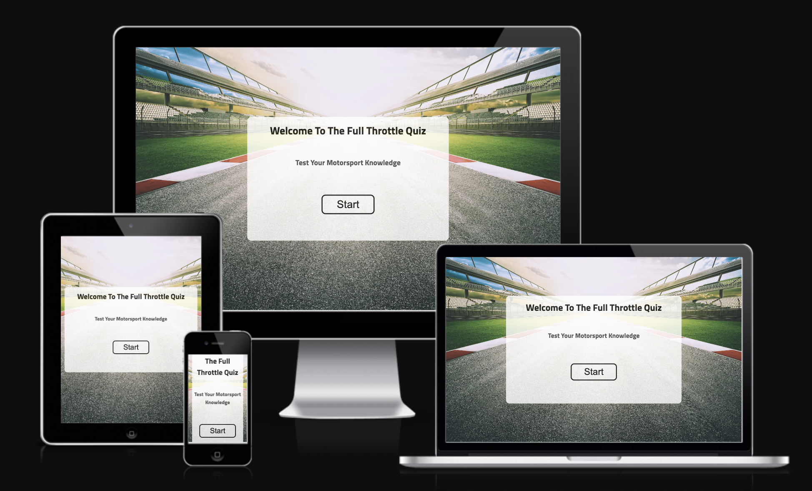
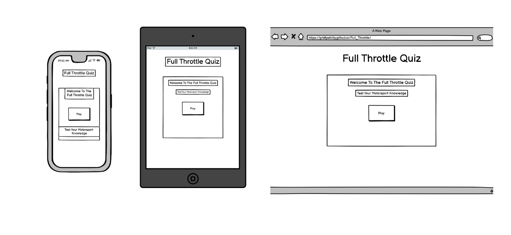
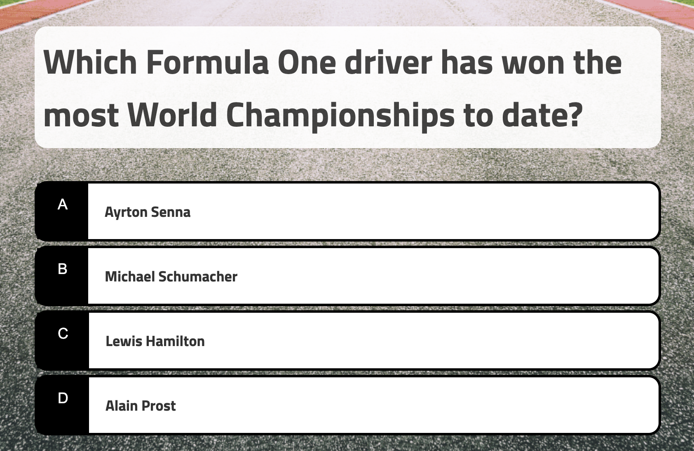

# Full Throttle

 Full Throttle will be targeted toward people who not only love motorsport but those who also like more advanced JavaScript concepts. Full Throttle is a fully responsive JavaScript quiz game that will allow users to answer a range of Formula 1 questions in order to recieve a score.

## Design

### Wireframes

Wireframes were created for mobile, tablet and desktop using balsamiq.

## Features 

### Existing Features

- __Full Throttle Start Page__

  - This section will allow a user to Start the Full Throttle Quiz where they can test their motorsport knowledge.

- __The Quiz Area__

  - This section will allow the user to play the quiz game. The user will be able to easily see the start quiz button for a serious of questions to follow.
  - 

- __The Score Area__

  - This section will allow the user to see exactly how many correct and incorrect answers they have provided. 

For some/all of your features, you may choose to reference the specific project files that implement them.

In addition, you may also use this section to discuss plans for additional features to be implemented in the future:

### Features Left to Implement

- Another feature idea

## Testing 

### Validator Testing 

- HTML
    - No errors were returned when passing through the official [W3C validator](link here)
- CSS
    - No errors were found when passing through the official [(Jigsaw) validator](Link here)
- JavaScript
    - No errors were found when passing through the official [Jshint validator](https://jshint.com/)
      - The following metrics were returned: 
      - There are 11 functions in this file.
      - Function with the largest signature takes 2 arguments, while the median is 0.
      - Largest function has 10 statements in it, while the median is 3.
      - The most complex function has a cyclomatic complexity value of 4 while the median is 2.

### Unfixed Bugs

You will need to mention unfixed bugs and why they were not fixed. This section should include shortcomings of the frameworks or technologies used. Although time can be a big variable to consider, paucity of time and difficulty understanding implementation is not a valid reason to leave bugs unfixed. 

## Deployment

- The site was deployed to GitHub pages. The steps to deploy are as follows: 
- Log in to your GitHub account. navigate to (link for project)
- You can set up your own repository and copy or clone it, or you fork the repository.
- Git add, git commit and git push to a GitHub repository, if necessary.
- GitHub pages will update from the master branch by default.
- Go to the Settings page of the repository.
- Scroll down to the Github Pages section.
- Select the Master Branch as the source and Confirm the selection.
- Wait a minute or two and it should be live for viewing. See my own here.
 
The live link can be found here - (https://phillywhitty.github.io/Full_Throttle/)

## Credits 

In this section you need to reference where you got your content, media and extra help from. It is common practice to use code from other repositories and tutorials, however, it is important to be very specific about these sources to avoid plagiarism. 

You can break the credits section up into Content and Media, depending on what you have included in your project. 

### Content 

- 
- 
- 

### Media

- 
- 

## Other General Project Advice
