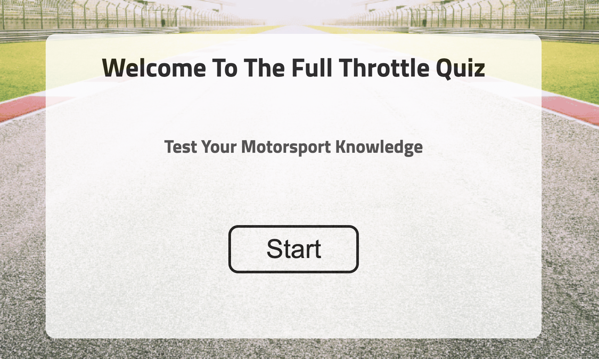

# Full Throttle

 Full Throttle will be targeted toward people who not only love motorsport but those who also like more advanced JavaScript concepts. Full Throttle is a fully responsive JavaScript quiz game that will allow users to answer a range of Formula 1 questions in order to recieve a score.

## Design

### Wireframes

Wireframes were created for mobile, tablet and desktop using balsamiq.

## Features 

### Existing Features

- __Full Throttle Start Page__

  - This section will allow a user to Start the Full Throttle Quiz where they can test their motorsport knowledge.

- __The Quiz Area__

  - This is the main quiz section. It provide a user with 10 questions and they have a selection of 4 answers per question.
  - 

- __The Score Area__

  - This section will allow the user to see exactly how many correct answers they have provided. It will also let the user see what question they are currently on.

### Features Left to Implement

- I was hoping to add in my score leaderboard for the quiz. I went through it with guidance and a youtube video but soon released that it seem
quite alot to take on board with the deadline coming up so my mentor suggested I focused on more basic functions and really come to grips with undertanding my project.

## Testing 

### Validator Testing 

- HTML
    - No errors were returned when passing through the official [W3C validator](https://validator.w3.org/nu/?doc=https%3A%2F%2Fphillywhitty.github.io%2FFull_Throttle%2F)
- CSS
    - No errors were found when passing through the official [(Jigsaw) validator](https://jigsaw.w3.org/css-validator/validator?uri=https%3A%2F%2Fphillywhitty.github.io%2FFull_Throttle%2F&profile=css3svg&usermedium=all&warning=1&vextwarning=&lang=en)
- JavaScript
    - No errors were found when passing through the official [Jshint validator]
      - The following metrics were returned: 
      - There are 7 functions in this file.
      - Function with the largest signature take 1 arguments, while the median is 1.
      - Largest function has 12 statements in it, while the median is 2.
      - The most complex function has a cyclomatic complexity value of 4 while the median is 1.

- Lighthouse Results
 

### Unfixed Bugs

There was an issue with my end.html file path that I had to leave unfixed due to the project time deadline. Everything was working fine on the broswer from my workspace.
The live link from github was showing a 404.error page just on my end.html file. The same thing happened to my background image so I changed the file path to a relative path for github. I also did the
same for my end.html and I taught the issue would have been resolved. Unfortunately I would have liked to dive into this issue further as it should have been an easy fix.
## Deployment

- The site was deployed to GitHub pages. The steps to deploy are as follows: 
- Log in to your GitHub account. navigate to (link for project)
- You can set up your own repository and copy or clone it, or you fork the repository.
- Git add, git commit and git push to a GitHub repository, if necessary.
- GitHub pages will update from the master branch by default.
- Go to the Settings page of the repository.
- Scroll down to the Github Pages section.
- Select the Master Branch as the source and Confirm the selection.
- Wait a minute or two and it should be live for viewing. See my own here.
 
The live link can be found here - (https://phillywhitty.github.io/Full_Throttle/)

## Credits 

- I also found my mentor Rory Fitzpatrick so supportive and he had me focused on the important elements and gave me confidence to get stuck into Javascript.
- I had the support of a friend called Michael Howlin who is a senior developer, he broke down some of the functions so I gained a deeper understanding of the Javascript.

### Content 

- I found James Q Quirks video on youtube a big help especially to structure the choice questions with javascript.
- I used all my images from Canva as I installed the pro version
- 

